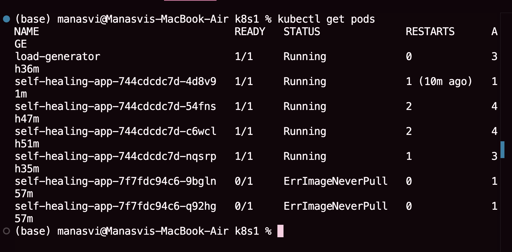
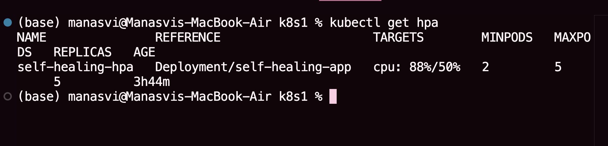
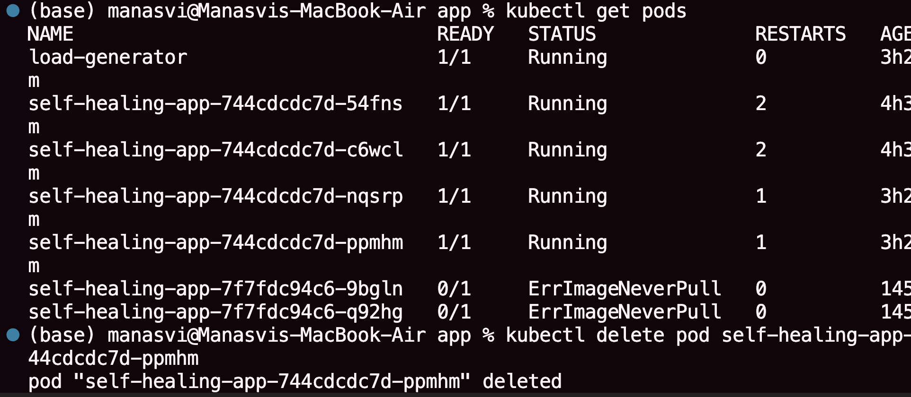
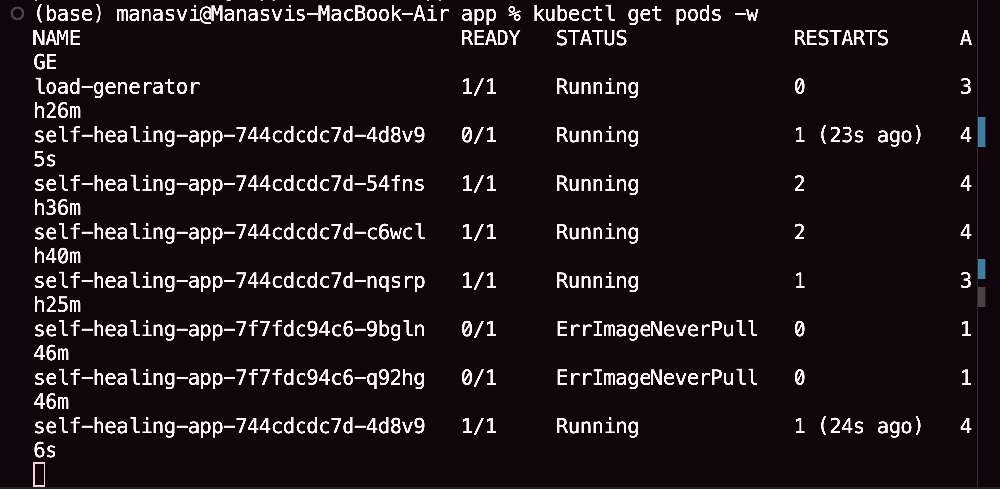

# ━━━━━━━━━━━━━━━━━━━━━━━━━━━━━━━━━━━━━━━━
#          KUBERNETES SELF-HEALING PLATFORM
# ━━━━━━━━━━━━━━━━━━━━━━━━━━━━━━━━━━━━━━━━

## ▌Overview

This project demonstrates a production-style deployment of an application on Kubernetes with **self-healing** and **auto-scaling capabilities**.

It highlights how Kubernetes ensures system reliability by automatically:
- Recovering failed pods
- Maintaining desired state
- Scaling applications dynamically based on load


---

## ▌Architecture


      User Request
           │
           ▼
    Ingress (NGINX)
           │
           ▼
    Service (ClusterIP)
           │
           ▼
      Deployment
           │
           ▼
    Pods (Replicated)

**Flow Explanation:**
- Ingress routes external traffic into the cluster  
- Service distributes traffic across pods  
- Deployment maintains desired number of replicas  
- Pods are automatically recreated on failure  

---

## ▌Tech Stack

| Layer            | Technology Used        |
|------------------|----------------------|
| Containerization | Docker               |
| Orchestration    | Kubernetes (Minikube)|
| Networking       | NGINX Ingress        |
| Scaling          | HPA (Horizontal Pod Autoscaler) |

---

## ▌Key Features

- Self-Healing: Automatic pod recovery on failure  
- Auto Scaling: Dynamic scaling using CPU utilization  
- Load Balancing: Traffic distribution via Kubernetes Services  
- External Access: Ingress-based routing  
- Fault Simulation: Manual pod deletion to test recovery  

---

## ▌Project Structure


kubernetes-self-healing/
│
├── k8s/ # Kubernetes YAML configurations
├── screenshots/ # Proof of working system
├── docs/
│ └── architecture.png
├── README.md


---

## ▌Setup Instructions

### 1. Start Kubernetes Cluster
```bash
minikube start
2. Enable Ingress
minikube addons enable ingress
3. Deploy Resources
kubectl apply -f k8s/
▌Application Access
minikube ip

Add to /etc/hosts:

<MINIKUBE-IP> myapp.local

Access the application:

http://myapp.local
▌Demonstration
Self-Healing
kubectl delete pod <pod-name>
kubectl get pods

Kubernetes automatically recreates the deleted pod.

Auto Scaling

Start load generator:

kubectl run -i --tty load-generator --image=busybox /bin/sh

Inside container:

while true; do wget -q -O- http://myapp.local; done

Monitor scaling:

kubectl get hpa -w
## ▌Screenshots

### Running Pods


### HPA Scaling


### Self-Healing Demonstration



▌Core Concepts Demonstrated

Declarative Infrastructure

Desired State Management

Pod Lifecycle Handling

Horizontal Scaling

Fault Tolerance in Distributed Systems

▌Why This Project Matters

This project reflects real-world DevOps capabilities:

Strong understanding of Kubernetes architecture

Ability to design resilient systems

Hands-on debugging and failure simulation

Production-oriented thinking

▌Future Enhancements

Add monitoring with Prometheus & Grafana

Implement CI/CD pipeline integration

Deploy on cloud (AWS / GCP)

Add logging with ELK stack

━━━━━━━━━━━━━━━━━━━━━━━━━━━━━━━━━━━━━━━━
End of Documentation
━━━━━━━━━━━━━━━━━━━━━━━━━━━━━━━━━━━━━━━━
